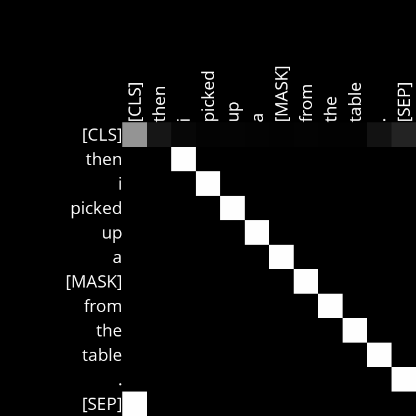
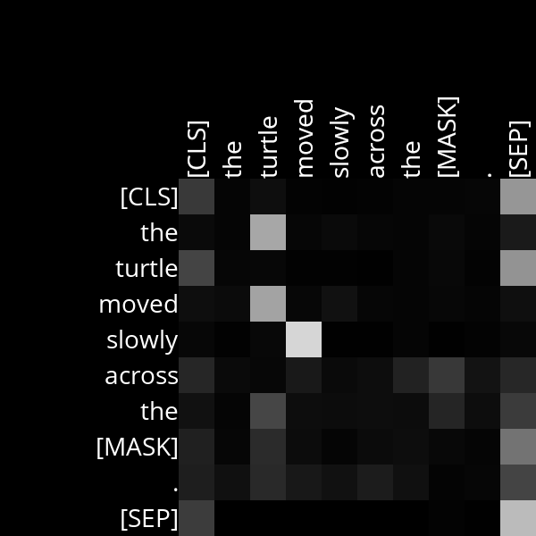

# Masked Language Model and Attention Analysis

## Objective

This project involves building an AI to predict a masked word in a text sequence using a Masked Language Model (MLM). The model is based on BERT, a transformer-based language model developed by Google. BERT is trained to predict a masked word in a sequence of text by understanding the context of surrounding words.

In the first part of the project, we will utilize the transformers Python library by Hugging Face to implement a program that predicts masked words using BERT. The program will also generate attention diagrams visualizing attention scores for each of the 144 attention heads in the BERT model.

The second part of the project involves analyzing the attention diagrams to gain insights into what BERT's attention heads might be focusing on as it processes natural language.

## Example Diagram

Attention heads might reveal patterns or relationships in language understanding.
Lighter colors represent higher attention weights, indicating stronger relationships between words.
Noisy attention heads may require interpretation to understand their focus.
Analysis involves making educated guesses about what attention heads are paying attention to based on diagrams.

**Attention head where each word pays strong attention to the word directly after it.**

**Attention head where the adverb 'slowly' pays attention to the verb it modifies 'moved'.**

